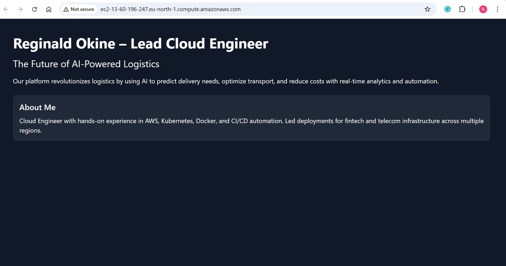

# AI‑Powered Logistics Prototype 🚚

**A dynamic, professionally deployed landing page showcasing a cloud-based AI logistics platform.**

---

## 🌐 Live Demo

This prototype is hosted on an AWS EC2 Ubuntu server:
**Public IP:** `ec2-13-60-196-247.eu-north-1.compute.amazonaws.com`  


---

## 📸 Screenshot



---

## 🛠️ Technology Stack

- **OS & Hosting**: Ubuntu 24.04 LTS on AWS EC2  
- **Web Server**: NGINX  
- **Frontend Styling**: Tailwind CSS  
- **Version Control**: Git + GitHub (SSH authenticated)  
- **Security**: EC2 Security Group allows HTTP/HTTPS; optional SSL with Let’s Encrypt  
- *(Optional future upgrades: Node.js backend, contact form, live map, CI/CD, CSS animations)*

---

## 🚀 Deployment Steps

1. **Provision & Update Server**
   ```bash
   ssh -i "reg_aws_key.pem" ubuntu@<public-ip>
   sudo apt update && sudo apt upgrade -y

